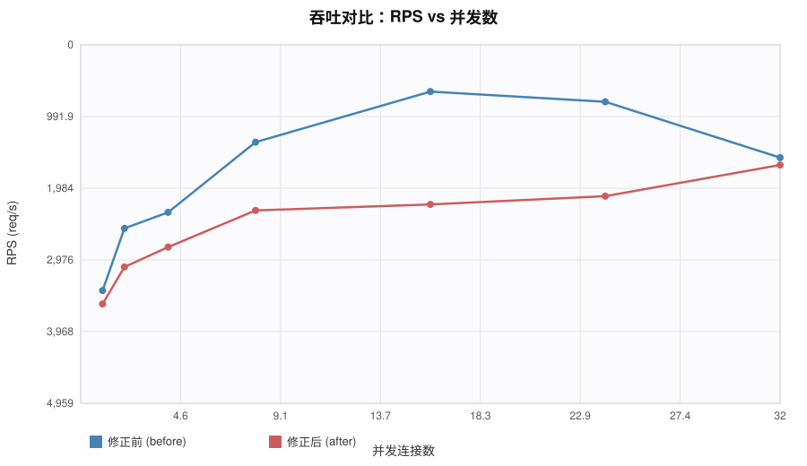
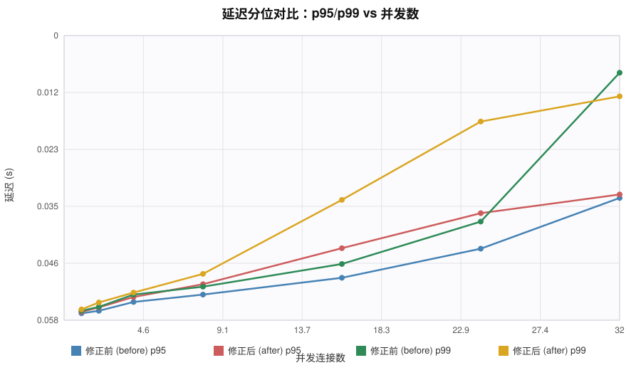
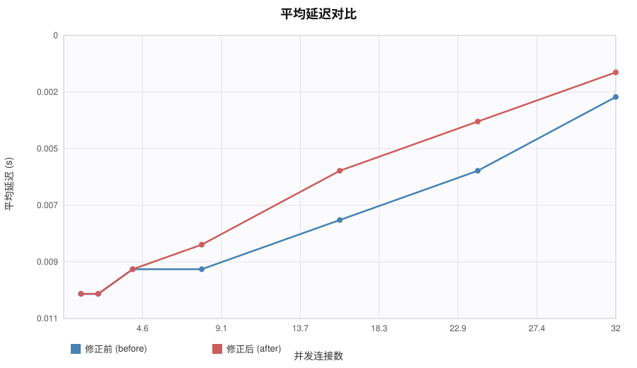
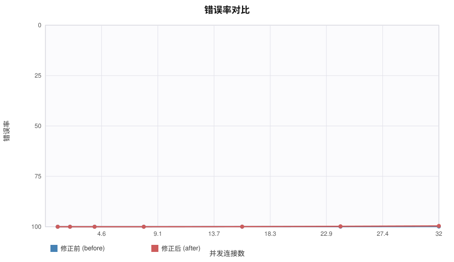
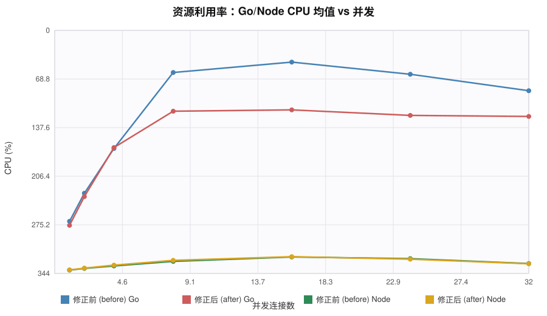
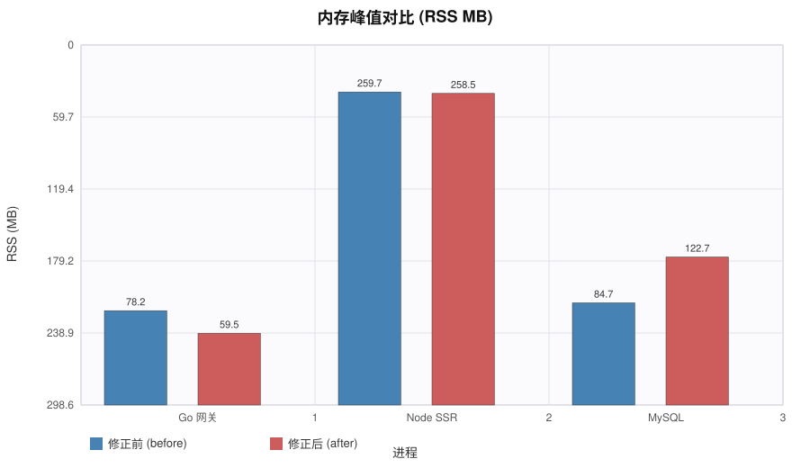
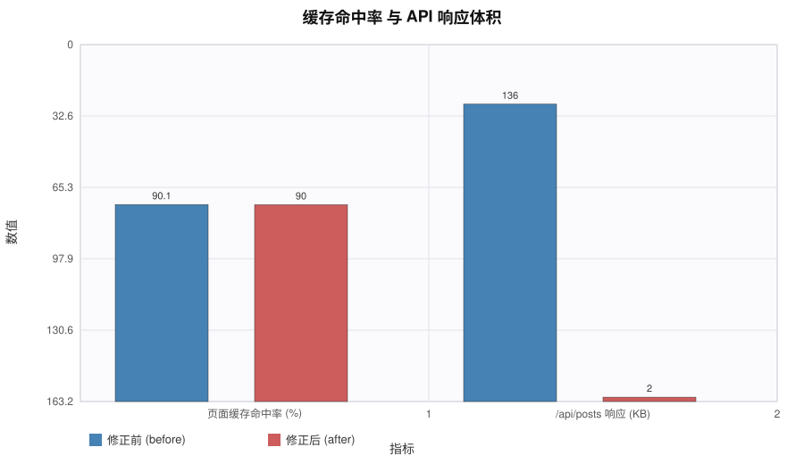

# 基准测试对比报告

- 修正前：A（2026-09-17 02:40:00）
- 修正后：B（2026-09-17 02:42:07）
- 环境：同机（本机）同 MySQL 实例、同端口、同种子数据；每档 12.03s

## 最高承载（错误率 ≤1% 的最高并发档）

| 版本 | 最高稳定并发 | RPS | p95 | 错误率 |
|---|---|---|---|---|
| 修正前 (before) | 32 | 3398.4 | 0.0248s | 0.09% |
| 修正后 (after) | 32 | 3297.0 | 0.0255s | 0.39% |

## 阶梯明细

| 并发 | A RPS | B RPS | A p50 | B p50 | A p95 | B p95 | A p99 | B p99 | A 错误率 | B 错误率 |
|---|---|---|---|---|---|---|---|---|---|---|
| 1 | 1559.5 | 1373.6 | 0.0005 | 0.0005 | 0.0014 | 0.0017 | 0.0019 | 0.0022 | 0.00% | 0.00% |
| 2 | 2419.8 | 1885.3 | 0.0007 | 0.0008 | 0.0019 | 0.0026 | 0.0027 | 0.0036 | 0.00% | 0.00% |
| 4 | 2642.7 | 2161.1 | 0.0011 | 0.0013 | 0.0037 | 0.0047 | 0.0052 | 0.0056 | 0.00% | 0.00% |
| 8 | 3612.5 | 2667.7 | 0.0018 | 0.0021 | 0.0052 | 0.0073 | 0.0068 | 0.0094 | 0.00% | 0.00% |
| 16 | 4312.6 | 2751.1 | 0.0027 | 0.0039 | 0.0086 | 0.0146 | 0.0114 | 0.0244 | 0.03% | 0.04% |
| 24 | 4170.9 | 2864.9 | 0.0042 | 0.0054 | 0.0145 | 0.0217 | 0.02 | 0.0403 | 0.06% | 0.20% |
| 32 | 3398.4 | 3297.0 | 0.0058 | 0.0059 | 0.0248 | 0.0255 | 0.0502 | 0.0454 | 0.09% | 0.39% |

## 缓存与载荷

- 页面缓存命中率（累计口径）：修正前 90.1%（hits=134,464/miss=14,820），修正后 90.0%（hits=104,347/miss=11,600）
- /api/posts 完整响应体积：修正前 136KB，修正后 2KB（分页后 2KB）

## 资源利用率（压测窗口均值/峰值）

| 版本 | Go CPU 均值 | Node CPU 均值 | Go RSS 峰值 | Node RSS 峰值 | MySQL RSS 峰值 |
|---|---|---|---|---|---|
| 修正前 (before) | 219.2% | 13.3% | 78MB | 260MB | 85MB |
| 修正后 (after) | 181.9% | 13.9% | 60MB | 258MB | 123MB |

## 图表

